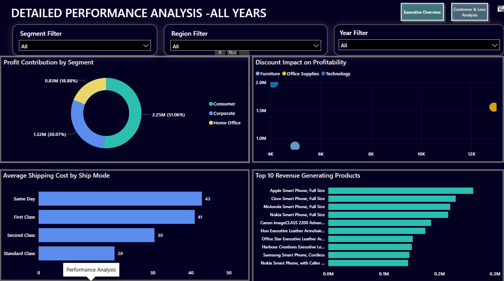
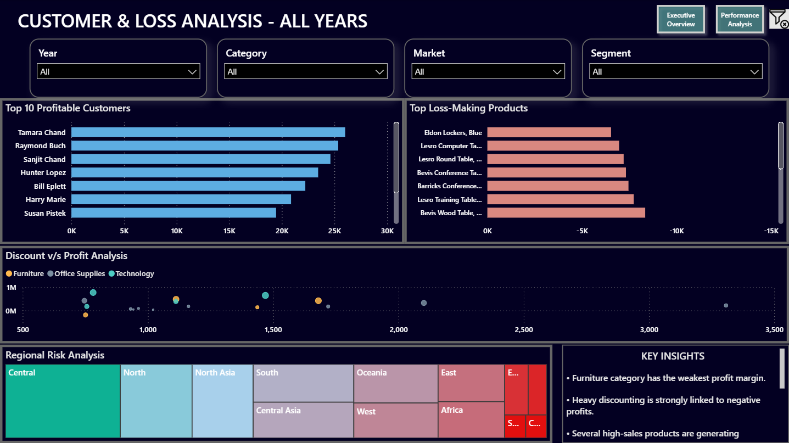
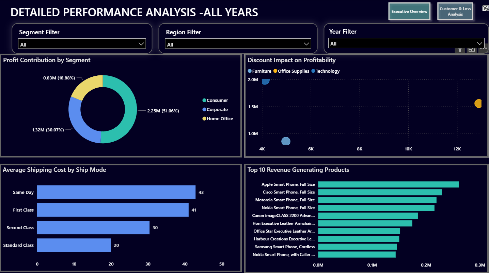

# 🛒 Global E-Commerce Sales Dashboard | SQL & Power BI

An end-to-end Business Intelligence dashboard built using SQL and Power BI to analyze sales performance, customer behavior, revenue trends, and customer segmentation. The project transforms raw business data into actionable insights through interactive dashboards and visual analytics.

## 🚀 Project Objectives

* Analyze overall sales and revenue performance
* Monitor customer purchasing behavior
* Identify high-value customer segments
* Track business performance through KPIs
* Support data-driven decision-making using interactive dashboards

## ✨ Key Features

### 📊 Executive Summary

* Total Revenue Analysis
* Customer Performance Metrics
* Revenue Trends
* Business KPI Monitoring

### 👥 Customer Overview

* Customer Behavior Analysis
* Revenue Contribution by Customers
* Purchase Pattern Analysis
* Customer Performance Tracking

### 🎯 RFM Segmentation

* Customer Segmentation using RFM Analysis
* High-Value Customer Identification
* Customer Retention Insights
* Revenue Distribution by Segment

## 🛠 Tools & Technologies

* SQL
* Power BI
* DAX
* Power Query
* Excel

## 📈 Skills Demonstrated

* Data Analysis
* Business Intelligence
* Dashboard Design
* Data Visualization
* SQL Querying
* DAX Calculations
* Data Cleaning & Transformation
* KPI Reporting

## 📊 SQL & Power BI Usage

### SQL

* Data extraction and analysis
* Joins and aggregations
* Business reporting queries

### Power BI

* Interactive dashboard development
* KPI cards and visualizations
* Customer segmentation analysis

### DAX

* Revenue calculations
* KPI measures
* Business performance metrics

### Power Query

* Data cleaning
* Data transformation
* Data preparation

## 📷 Dashboard Preview

### 📊 Executive Summary

### 👥 Customer Overview

### 🎯 RFM Segmentation

## 💡 Business Insights

* Identified high-value customer segments using RFM analysis
* Analyzed customer purchasing behavior and revenue contribution
* Monitored overall business performance through KPI tracking
* Enabled data-driven decision-making using interactive dashboards

## 📁 Files Included

* Global_Ecommerce_PowerBI_Dashboard.pbix
* screenshots/
